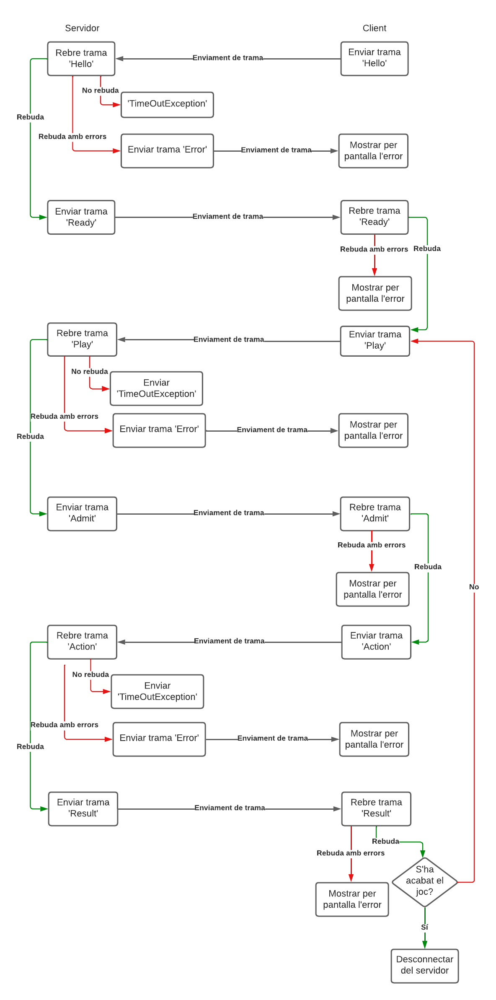

[](https://classroom.github.com/online_ide?assignment_repo_id=10165869&assignment_repo_type=AssignmentRepo)
# Software Distribuït 2023


## P1 - Client / Servidor

La practica 1 consisteix en implementar un joc senzill amb arquitectura Client-Servidor fent servir Sockets amb Java. Establirem un protocol i els seus estats a seguir de manera que qualsevol grup podrà testejar el seu Client contra qualsevol Servidor d'un altre grup, i viceversa.

* Es programarà en Java.
* Es seguirà estrictament la [guia d'estil de JAVA](https://google.github.io/styleguide/javaguide.html) per la primera pràctica tan pel que fa al codi com a la documentació.

## Execució 

L'execució seguirà obligatòriament els següents paràmetres:

**Servidor**

Estant dins del directori *Server/src*, executem la següent comanda a la terminal:

```console
java -jar Server.jar -p <port> -m <game mode>
```
  
On:
* -p: port a on establir-se
* -m: mode de joc (0 -> Client vs Server / 1 -> Client vs Client)

**Client**

Estant dins del directori *Client/src*, executem la següent comanda a la terminal:

```console
java -jar Client.jar -h <host> -p <port>
```

On:
* -h: IP o nom de la màquina a on connectar-se
* -p: port on trobar el servidor


## Testing

Per tal de fer els tests d'aquesta pràctica, hem creat una classe *UtilsTest* que comprova el correcte funcionament dels mètodes que hem implementat a la classe *Utils*. *UtilsTest.java* es troba a la ruta principal del repositori. Per tal d'executar els tests, hem de seguir els següents passos:

```console
javac -cp .:lib/junit-4.13.2.jar:lib/hamcrest-core-1.3.jar Utils.java UtilsTest.java

java -cp .:lib/junit-4.13.2.jar:lib/hamcrest-core-1.3.jar org.junit.runner.JUnitCore UtilsTest
```

La primera comanda compila les classes *Utils.java* i *UtilsTest.java* i afegeix al *ClassPath* el *junit* i el *hamcrest*.

La segonda comanda executa els tests i ens retorna el següent output:

```console
JUnit version 4.13.2
................
Time: 0,012

OK (16 tests)
```

## Proves realitzades a la sessió de test

A la sessió de test vam aprofitar sobretot per testejar la nostra implementació de les classes Server, GameHandler i GameProtocol. La sessió de test ens va ajudar molt a trobar errors que d'altre forma molt segurament no haguéssim detectat, ja que si bé és cert que amb la nostra implementació de Client tot funcionava, la idea era que funcionés amb qualsevol implementació dels altres companys.

També vam provar la implementació de Client per tal de donar feedback als altres grups de com funcionaven les seves implementacions de les classes Server.

No vam poder provar la implementació de Client vs Client a la sessió de test, ja que no la teniem implementada encara, tot i que confiem en que ho haguem realitzat de manera satisfactoria per tal d'optar a la màxima nota possible.

Hem afegit els logs que vam obtenir a la sessió de test a la carpeta *Logs* del repositori. No hi són tots els que vam obtenir ja que a l'iniciar varis cops el Server, s'avaven sobreescrivint.


## Errors detectats a la sessió de test

A la sessió de test vam trobar els següents errors:
* No ens havíem fixat en la diferència entre la funció *writeChars()* i la funció *writeBytes()* (aquesta no escriu en UTF, que es el que esperàvem en el nostre protocol).
* El Server no s'executava si la carpeta de Logs no existia. Aquest problema el vam solucionar posant una part de codi que comprovés primer si la carpeta de Logs existia, sinó la creava.
* Pensàvem que podíem comprovar si el Socket continuava obert en l'altre extrem de la connexió fent ús dels mètodes *isConnected()* i/o *isClosed()*. Vam veure però que això no era així, ja que aquestes funcions no poden asssegurar si l'altre *ending point* del Socket segueix connectat o no. Així que per l'apartat del *timeout* vam decidir que cada cop que fesim un *catch* del *SocketTimeoutException* sumariem a un comptador els cops que haguéssim entrat al *catch*, si arrribem al màxim que vam establir com a variable global, tanquem el Socket. El *timeout* del Socket el vam establir a 5 segons, i el màxim comptador de *timeouts* a 180, és a dir, 36 minuts.
* No controlàvem les excepcions de tipus *SocketException* a Client. Vam afegir el control d'aquestes excepcions a la classe Client, per quan rebíem un *Connection reset* des del Server.
* No controlàvem les excepcion de tipus *EOFException* a la classe Server quan el Client es desconnectava. Vam afegir llavors el tractament d'aquestes excepcions.
* Si el Server jugava un altre partida, podia disparar sense bales. Vam veure que al computar com a result *ENDS0* o *ENDS1*, no configuràvem les bales tant del client com del servidor a 0.
* Havíem implementat de manera errònea el multithreading. Ens vam complicar massa a l'hora de crear la comanda per fer l'*start* del multithreading, quan només era necessari fer el següent:

```java
new GameHandler(socket, logger).start();
```

Com no havíem configurat bé el multithreading, moltes de les proves que vam realitzar a la sessió de test, si es connectaven vàries persones alhora, no ens donàven els resultats esperats.

## Heurística

El mètode *computeAction()*, estableix una sèrie de heurístiques per determinar l'acció que ha de realitzar el servidor. Les heurístiques es basen en el nombre de bales que tenen tant el servidor com el client. El mètode es divideix en tres casos principals:

* Si el servidor té bales (> 0), és més probable que dispare o bloquegi, ja que podria guanyar si el client està carregant. En aquest cas, es genera un nombre aleatori, i segons el seu valor, es realitza una de les següents accions:

  - Si el nombre és inferior a 0,5: dispara ("SHOOT").
  - Si el nombre és inferior a 0,8: bloqueja ("BLOCK").
  - Si no es compleix cap de les condicions anteriors: carrega ("CHARG").

* Si el client té bales (> 0) i el servidor no en té, el servidor podria estar en risc. Així, és més probable que bloquegi o carregui. Es genera un altre nombre aleatori, i segons el seu valor, es pren una de les següents accions:

  - Si el nombre és inferior a 0,6: bloqueja ("BLOCK").
  - Si no es compleix la condició anterior: carrega ("CHARG").
  - Si cap dels dos jugadors té bales, és probable que ambdós carreguin. No obstant això, el servidor pot intentar bloquejar o carregar per sorprendre al client. Es genera un tercer nombre aleatori, i segons el seu valor, es realitza una de les següents accions:

  - Si el nombre és inferior a 0,6: carrega ("CHARG").
  - Si no es compleix la condició anterior: bloqueja ("BLOCK").

Aquestes heurístiques prenen decisions basades en les circumstàncies del joc, com ara el nombre de bales disponibles, i utilitzen nombres aleatoris per a introduir incertesa i dificultar la predicció de l'acció del servidor per part del client.

## Diagrama d'execució


